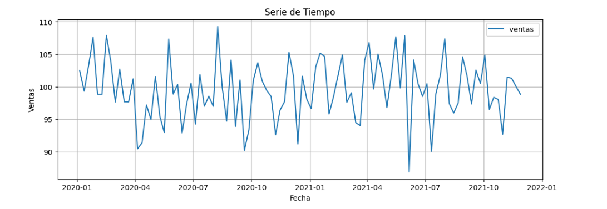
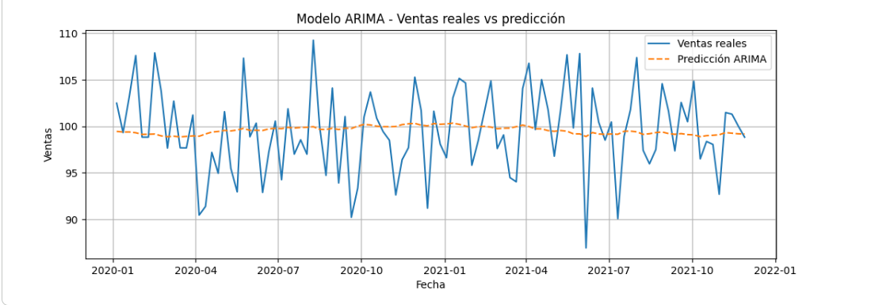

# Pronóstico de Ventas con Series de Tiempo y Modelo ARIMA en Python

## Descripción del proyecto

Este proyecto desarrolla un análisis de series de tiempo utilizando Python, con el objetivo de evaluar la estacionariedad de una serie simulada de ventas semanales e implementar un modelo ARIMA para generar pronósticos futuros.

## Objetivo

Aplicar técnicas de análisis exploratorio, estadístico y modelamiento de series de tiempo para comprender el comportamiento de una variable de ventas y proyectar valores futuros mediante un modelo ARIMA.

## Tecnologías utilizadas

- Python
- Google Colab
- Pandas
- NumPy
- Matplotlib
- Statsmodels
- Scikit-learn

## Etapas del proyecto

1. Simulación de datos de ventas semanales.
2. Creación del DataFrame.
3. Análisis exploratorio de datos.
4. Análisis estadístico descriptivo.
5. Evaluación de estacionariedad.
6. Aplicación de media móvil y desviación móvil.
7. Prueba ADF.
8. Implementación del modelo ARIMA(1,0,1).
9. Evaluación del modelo mediante residuos y métricas de error.
10. Pronóstico futuro de ventas.

## Visualizaciones del Proyecto 

### Serie de Tiempo

La serie de tiempo muestra el comportamiento de las ventas simuladas a lo largo del periodo analizado. Se observa que los valores fluctúan alrededor de una media estable, sin presentar una tendencia creciente o decreciente marcada.

### Modelo ARIMA

El gráfico del modelo ARIMA permite comparar los valores reales con los valores ajustados por el modelo. Las predicciones se mantienen cercanas al promedio histórico, lo cual es coherente con una serie estacionaria.

## Análisis estadístico

Los principales indicadores estadísticos obtenidos fueron:

| Indicador | Valor |
|---|---:|
| Media | 99.48 |
| Moda | 86.90 |
| Desviación estándar | 4.54 |
| Varianza | 20.62 |

Estos resultados muestran que la serie mantiene un comportamiento estable, con valores de ventas cercanos a una media de 100 unidades y una dispersión moderada.

## Modelo ARIMA

Se implementó un modelo `ARIMA(1,0,1)` debido a que la serie fue identificada como estacionaria.

- `p = 1`: considera el valor anterior de la serie.
- `d = 0`: no se aplica diferenciación, ya que la serie es estacionaria.
- `q = 1`: incorpora el error del periodo anterior para mejorar el ajuste del modelo.

## Resultados principales

La serie simulada presentó un comportamiento estacionario, ya que los valores de ventas fluctuaron alrededor de una media estable cercana a 100 unidades, sin evidenciar una tendencia creciente o decreciente marcada.

El modelo ARIMA(1,0,1) permitió generar un pronóstico futuro coherente con el comportamiento histórico de la serie, manteniendo valores cercanos al promedio observado.

## Conclusión

Este proyecto permitió aplicar conceptos fundamentales del análisis de series de tiempo, desde la exploración inicial de los datos hasta la implementación y evaluación de un modelo ARIMA. Además, permitió comprender la importancia de validar la estacionariedad antes de aplicar modelos de pronóstico.

## Autor

Macarena Acevedo
